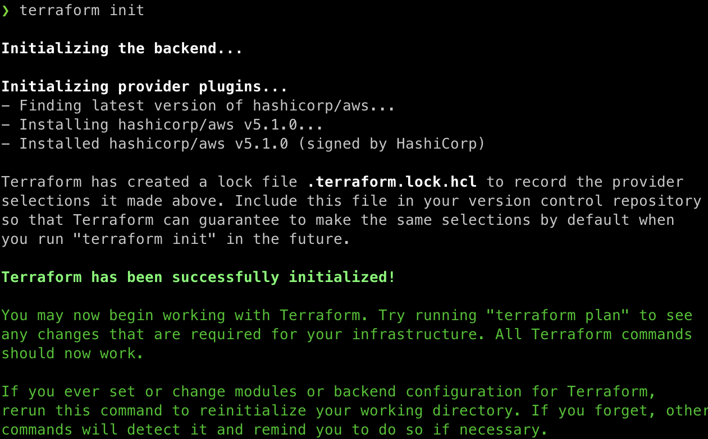
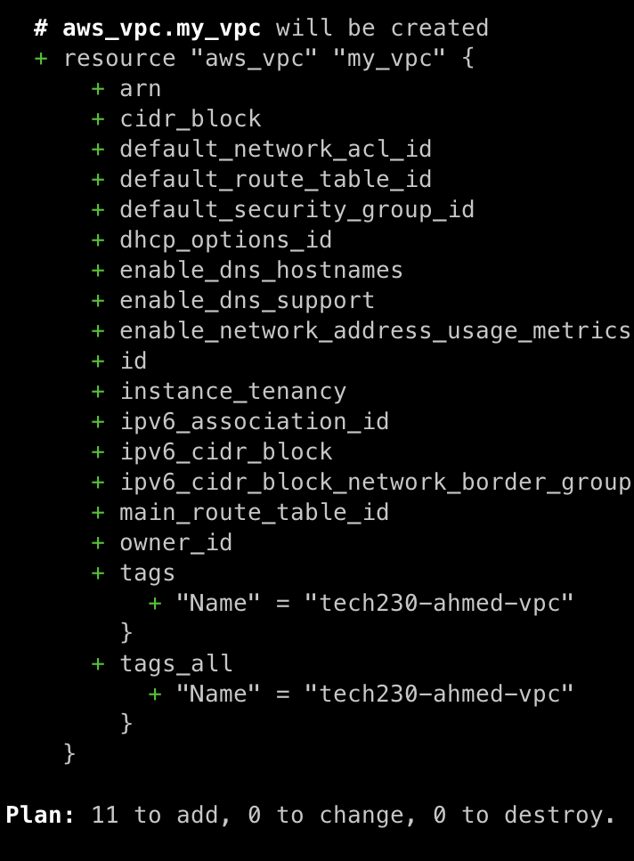
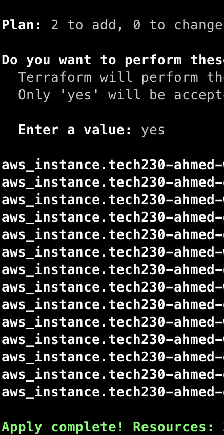

# terraform

1. provisioning

main.tf as configuration file
it configures terraform
terraform deploys to cloud

terraform first provisions the initial infrastructure, then a conifguration

2. configuring management tool like ansible install and updates software

playbook.yml conifgures ansible. installs and updates software

create env var called AWS_ACCESS_KEY_ID
AWS_SECRET_ACCESS_KEY_ID

check printenv and you shoudl see the keys

sudo nano main.tf in terraform directory
enter admin password

to create a service on aws cloud
to launch an ec2 in ireland
terraform to download required packages
terraform innit

let terraform know who the provider is

provider "aws" {
#which region of aws
region: "eu-west-1"
}

save file

run `terraform init`

# gitbash must have admin access

# launch an ec2

# which resource -

resource "aws_instance" "app_instance"{

# which AMI - ubuntu 18.04

        ami = "ami-00e8ddf087865b27f"

# type of instance t2.micro

        instance_type = "t2.micro"

# do you need public ip = yes

        associate_public_ip_address = true

# name your public ip

        tags = {
        Name = "ahmed-tech230-terraform-app"

}

}

check syntax error:

`terraform plan`

if output shows all ietms as 'green' then no syntax error.

`terraform apply` - you're askign aws to open the door and create the instance, you can check by loggin in to aws and see

instance is launched in default vpc

next step is to launch it in your own vpc

`terraform destroy` - to shut down all instances

terraform

# To create a VPC with terraform

1. Define provider and region

```
provider "aws" {
	region = "eu-west-1"
}
```

2. Create VPC and name it appropriately

```
resource "aws_vpc" "my_vpc" {
	cidr_block = "10.0.0.0/16"
	tags = {
		Name = "tech230-ahmed-vpc"
	}
}
```

3. Create Internet Gateway to allow resources in the public subnet to connect to the internet

```
resource "aws_internet_gateway" "igw" {
	vpc_id = aws_vpc.my_vpc.id
	tags = {
		Name = "tech230-ahmed-igw"
	}
}
```

4. Create a Private Subnet to host resources like your DB as we do not want unwanted access to it

```
resource "aws_subnet" "private_subnet" {
  vpc_id = aws_vpc.my_vpc.id
  cidr_block = "10.0.3.0/24"
  tags = {
          Name = "tech230-ahmed-private-subnet"
  }
}
```

5. Create Public Subnet to host the App

```
resource "aws_subnet" "public_subnet" {
  vpc_id = aws_vpc.my_vpc.id
  cidr_block = "10.0.2.0/24"
  tags = {
          Name = "tech230-ahmed-public-subnet"
  }
}
```

6. Create Public Route Table to direct traffic

```
resource "aws_route_table" "public_route_table" {
	vpc_id = aws_vpc.my_vpc.id
	tags = {
		Name = "tech230-ahmed-public-RT"
	}
}
```

7. Creating a route and linking it to the intenret gateway we have created

```
resource "aws_route" "public_route" {
	route_table_id = aws_route_table.public_route_table.id
	destination_cidr_block = "0.0.0.0/0"
	gateway_id = aws_internet_gateway.igw.id
}
```

8. Link the public route table with the public subnet

```
resource "aws_route_table_association" "public_subnet_association" {
	subnet_id = aws_subnet.public_subnet.id
	route_table_id = aws_route_table.public_route_table.id
}

```

9. Create a security group to set ruls for inbound traffic for both the app and db.

```
### App SG

resource "aws_security_group" "tech230-ahmed-app-sg" {
name = "tech230-ahmed-app-sg"
description = "Security group for Sparta Test App"
vpc_id = aws_vpc.my_vpc.id

    ingress {

    	from_port   = 22
    	to_port     = 22
    	protocol    = "tcp"
    	cidr_blocks = ["<your-ip>"]
    }


    ingress {

    	from_port   = 80
    	to_port     = 80
    	protocol    = "tcp"
    	cidr_blocks = ["0.0.0.0/0"]
    }

    ingress {
    	from_port   = 3000
    	to_port     = 3000
    	protocol    = "tcp"
    	cidr_blocks = ["0.0.0.0/0"]
    }

    ingress {
    	from_port   = 27017
    	to_port     = 27017
    	protocol    = "tcp"
    	cidr_blocks = ["10.0.3.0/24"]
    }

    egress {
    	from_port   = 0
    	to_port     = 0
    	protocol    = "-1"
    	cidr_blocks = ["0.0.0.0/0"]
    }

}

### DB SG

resource "aws_security_group" "tech230-ahmed-db-sg" {
name = "tech230-ahmed-db-sg"
description = "Security group for MongoDB"
vpc_id = aws_vpc.my_vpc.id

    ingress {
    	from_port        = 27017
    	to_port          = 27017
    	protocol         = "tcp"
    	cidr_blocks = ["10.0.2.0/24"]
    }

    egress {
    	from_port   = 0
    	to_port     = 0
    	protocol    = "-1"
    	cidr_blocks = ["0.0.0.0/0"]
    }

}
```

10. You can now launch EC2 instances from our AMI's for both App and DB.

### App

```
resource "aws_instance" "tech230-ahmed-app" {
	ami           = "ami-00e8ddf087865b27f"
	instance_type = "t2.micro"
	key_name      = "tech230"
	subnet_id     = aws_subnet.public_subnet.id
	vpc_security_group_ids = [aws_security_group.tech230-ahmed-app-sg.id]
	associate_public_ip_address = true

	tags = {
		Name = "tech230-ahmed-app"
	}
}
```

```
# DB

resource "aws_instance" "tech230-ahmed-db" {
ami = "ami-00e8ddf087865b27f"
instance_type = "t2.micro"
key_name = "tech230"
subnet_id = aws_subnet.private_subnet.id
vpc_security_group_ids = [aws_security_group.tech230-ahmed-db-sg.id]

    tags = {
    	Name = "tech230-ahmed-db"
    }

}

```

11. Run the following command to initilize terraform

```
terraform init
```



output

12. Run the following command to plan the build and check for syntax errors

```
terraform plan
```



13. Run the command below to request aws to allow access, for this happen we would have already saved the access key as follows:

- Open bash terminal and enter the following:

```
export AWS_ACCESS_KEY="keyvaluegoeshere"
export AWS_ACCESS_SECRET_KEY="secretkeygoeshere"
```

You can double check this has been succesfful by running printenv and you should see the key saved there.

To access aws via terraform:

```
terraform apply
```



14.
